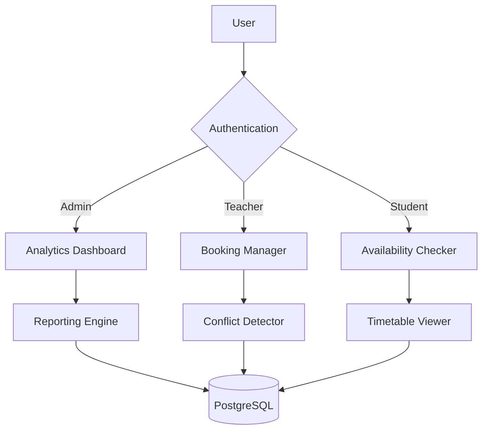
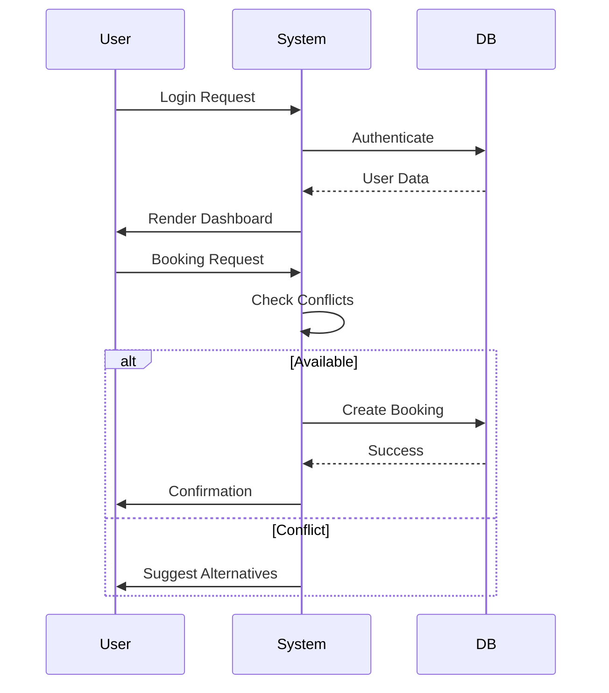

# 🏫 College Classroom Management System

[](https://www.djangoproject.com/)
[](https://www.django-rest-framework.org/)
[](https://github.com/Rakshak-D/config/issues)
[](LICENSE)

A comprehensive Django-based solution for optimizing classroom resource management, featuring real-time analytics, conflict-free booking system, and multi-role access control.


---

## ✨ Key Features

### 📊 Admin Dashboard
- Real-time classroom utilization heatmaps
- Faculty workload distribution charts
- Instant booking approvals/rejections
- System health monitoring

### 🗓️ Booking Management
- Smart conflict detection algorithm
- Multi-criteria availability search
- Historical booking analysis
- Automated email notifications

### ⏰ Timetable Operations
- Bulk CSV/Excel import with validation
- Interactive drag-drop timetable editor
- Cross-platform export (PDF/CSV/Excel)
- Teacher schedule optimization

### 👨🎓 Student Portal
- Real-time classroom status updates
- Course timetable browser
- Booking request submission
- Mobile-first responsive design

### 🔐 Security
- Role-based access control (RBAC)
- CSRF-protected API endpoints
- Session timeout enforcement
- Password complexity policies

---

## 🚀 Quick Start

### Prerequisites
- Python 3.9+
- PostgreSQL 14+
- Node.js 18+ (for frontend build)

```bash
# Clone repository
git clone https://github.com/Rakshak-D/config.git
cd config

# Set up environment
python -m venv .venv
source .venv/bin/activate  # Linux/Mac
.venv\Scripts\activate     # Windows

# Install dependencies
pip install -r requirements.txt

# Configure environment
echo "SECRET_KEY=your-secret-key" > .env
echo "DEBUG=True" >> .env

# Database setup
python manage.py migrate
python manage.py createsuperuser

# Start server
python manage.py runserver
```

**Access Endpoints:**
- Admin Dashboard: `http://localhost:8000/admin-dashboard/`
- Teacher Portal: `http://localhost:8000/teacher/`
- Student Portal: `http://localhost:8000/student/`
- API Documentation: `http://localhost:8000/api/docs/`

---

## 🌐 System Overview

### Architecture Diagram


### Data Flow


---

## 🛠 Technology Stack

| Component       | Technologies                                |
|-----------------|--------------------------------------------|
| **Frontend**    | HTML5, CSS3, JavaScript, Chart.js          |
| **Backend**     | Django 4.2, Django REST Framework          |
| **Database**    | PostgreSQL, SQLite (Development)           |
| **Security**    | CSRF Tokens, HTTPS, PBKDF2 Hashing         |
| **DevOps**      | Docker, Nginx, GitHub Actions              |
| **Analytics**   | Pandas, Matplotlib, OpenPyXL               |

---

## 📂 Repository Structure

```
config/
├── accounts/          # Authentication system
│   ├── models/        # Custom user models
│   ├── auth/          # Authentication backends
│   └── signals.py     # Profile signals
├── analytics/         # Data analysis
│   ├── reports/       # PDF generators
│   └── visualizations # Chart templates
├── booking/           # Reservation system
│   ├── api/           # REST endpoints
│   └── algorithms/    # Conflict detection
├── classroom/         # Resource management
│   ├── validators/    # Capacity checks
│   └── fixtures/      # Initial data
├── static/            # Static assets
│   ├── js/            # Interactive components
│   └── scss/          # Style preprocessing
└── templates/         # UI components
    ├── components/    # Reusable widgets
    └── layouts/       # Page templates
```

---

## 📝 Core Dependencies

```text
# Base Requirements
Django==4.2.11
djangorestframework==3.15.1
pandas==2.2.1
python-dotenv==1.0.0

# Security
bcrypt==4.0.1
django-csp==3.1

# Data Handling
openpyxl==3.1.2
python-dateutil==2.9.0
```

---

## 🐛 Issue Reporting

[](https://github.com/Rakshak-D/config/issues)

**Bug Report Template:**
```markdown
## Description
[Clear explanation of the issue]

## Reproduction Steps
1. Navigate to...
2. Click on...
3. Observe...

**Expected Behavior**  
[Expected outcome]

**Actual Behavior**  
[Actual outcome]

**Environment**  
- OS: [e.g., Ubuntu 22.04]
- Browser: [e.g., Firefox 120]
- Django Version: 4.2.11

**Additional Context**  
[Screenshots/Logs]
```

**Issue Labels**  
- `bug` - Functional errors
- `feature` - New capability requests
- `security` - Vulnerability reports
- `docs` - Documentation improvements

---

## 📜 License

This project is licensed under the MIT License - see [LICENSE](LICENSE) for complete terms.

---

## 📬 Contact & Support

**Project Maintainer**  
Rakshak D  
📧 rakshakmce@gmail.com  
🔗 [GitHub Profile](https://github.com/Rakshak-D)  


## 🛠️ Development Roadmap

### Next Milestones
- 🗓️ Calendar Sync (iCal/Google)
- 📱 Progressive Web App Conversion
- 🤖 AI-powered Booking Suggestions
- 🌐 Multi-language Support

### Contribution Guide
1. Fork repository
2. Create feature branch (`git checkout -b feat/awesome-feature`)
3. Commit changes (`git commit -am 'Add awesome feature'`)
4. Push to branch (`git push origin feat/awesome-feature`)
5. Open Pull Request

**Code Standards**  
- Follow PEP8 guidelines
- Maintain 90%+ test coverage
- Document complex algorithms
- Use conventional commits

---
